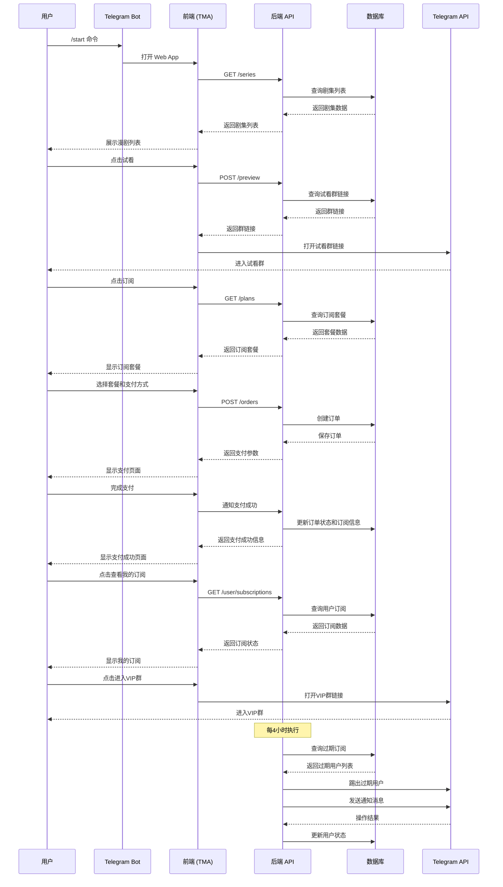
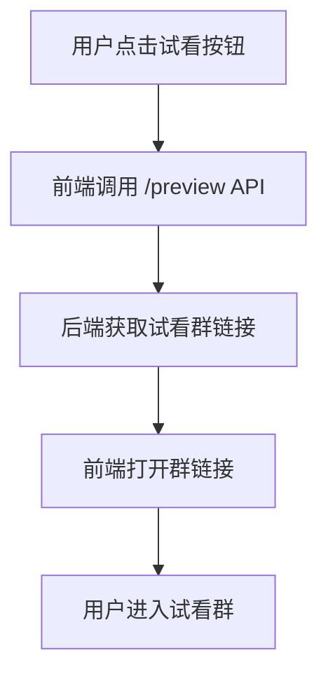
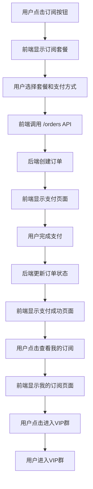
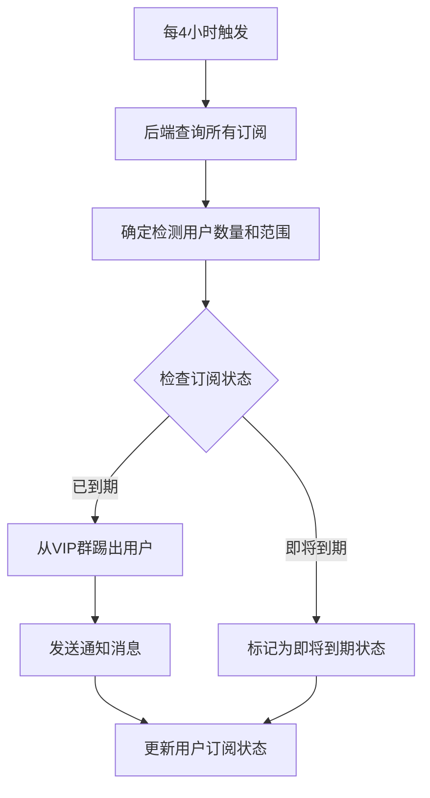

# 漫剧订阅 Bot 功能描述 V1.0

## 系统概述

本系统是一个基于 Telegram Bot 的漫剧订阅、付费入群、自动群权限管控系统。系统分为前端（Telegram Web App）和后端（Node.js 服务）两部分，实现了漫剧内容分发、试看引流、付费订阅、社群权限管理、到期自动管控的一体化订阅功能。

## 核心功能

### 1. 用户端功能

#### 1.1 欢迎模块
- Bot 首次触发/唤醒时，发送配置化欢迎信息
- 固定底部按钮栏：【查看所有剧集】、【我的订阅】、【联系客服】

#### 1.2 漫剧列表模块
- 展示漫剧列表，包含封面剧照、漫剧名称、简介
- 每部漫剧下方设有【免费试看】和【订阅】按钮
- 点击试看按钮：直接进入试看群（试看群链接是后台提前配置好的）
- 点击订阅按钮：跳转进入该漫剧订阅支付页面

#### 1.3 订阅支付模块
- 按订阅时长设定对应价格（时长/价格后台可配置）
- 支付方式：TG Star (Telegram Stars)、USDT (TRC20)、支付宝
- 支付流程：选择时长 → 选择支付方式 → 进入付款流程 → 支持中途返回取消
- 付款成功：自动激活订阅、绑定剧集，提示用户进入我的订阅中查看

#### 1.4 我的订阅模块
- 无订阅：展示空状态，配置一个漫剧列表的按钮，方便用户去浏览漫剧列表
- 有订阅：列表展示已订阅漫剧 + 订阅到期时间 + 状态（正常/即将到期/已到期）
- 单剧集操作按钮：【进入对应VIP群】
- 底部固定按钮：【返回漫剧列表】

### 2. 后台管理功能

#### 2.1 管理员登录与权限
- 登录方式：谷歌账号登录
- 关键操作：修改收款地址需管理员谷歌账号二次授权/审批

#### 2.2 Bot 基础配置
- 配置项：Bot Token、Webhook URL
- 欢迎信息配置：自定义欢迎文案

#### 2.3 漫剧剧集管理
- 字段：漫剧名称、上架/下架状态、封面剧照上传、试看群链接/配置、订阅时长价格、对应VIP群配置、对应会员群配置
- 操作：新增、编辑、删除、上下架、群绑定

#### 2.4 用户管理
- 核心统计功能：用户总量统计、活跃用户数、新增用户数、订阅用户统计、订阅状态统计、复购用户数
- 展示形式：概览展示、趋势展示、占比展示、明细展示
- 用户信息：Telegram 原生全量信息（用户 ID、用户名、昵称、头像、语言等）
- 订阅信息：支持一人多订阅，展示每部剧集订阅状态、到期时间、当前所在群及群名

#### 2.5 财务中心
- 核心统计功能：流水统计、总流水、单剧集流水、支付方式统计
- 展示形式：概览展示、趋势展示、占比展示、明细展示
- 流水记录：订单号、用户、剧集、支付方式、金额、时间、支付状态、收款地址
- 支付管理：支持按支付方式配置多收款地址，修改收款地址必须走管理员审批

#### 2.6 系统设置
- 检测原则说明：每4小时执行一次过期检查，确保群内所有用户都在每次启动检测后被检测一次
- 即将到期时间配置：可定义什么是即将到期，默认为小于7天到期为即将到期状态

### 3. 群权限自动管控模块

- 检测规则：每4小时执行一次全量检测（零点零分、4点零分、8点零分、12点零分、16点零分、20点零分）
- 检测原则：确保群内每位用户都在每次启动检测后被检测到一次，启动检测时，要首先确定检测用户数量和范围，以防止有新用户不断进入导致程序进入不断检测
- 用户状态判定：已注册（但未进入任何群）、会员群、VIP群
- 管控动作：
  - VIP群中订阅即将到期用户 →BOT将其在后台管理页面 标记为即将到期状态，并将该状态匹配给用户的“我的订阅”中的剧集下方，点击即将到期可以让用户进行付费预定，付费预定支付成功后的续期是从用户到期日期向后自动累加。
  - 已到期用户 → 移出VIP群并发送通知消息

## 技术实现

### 前端技术栈
- React
- Tailwind CSS
- Telegram Web App SDK

### 后端技术栈
- Node.js
- Express/Fastify
- Telegraf (Telegram Bot 框架)
- MongoDB/PostgreSQL
- node-cron (定时任务)

### API 接口

#### 前端接口
- `GET /series` - 获取剧集列表
- `GET /plans?series_id={id}` - 获取订阅套餐
- `POST /preview` - 获取试看群链接
- `POST /orders` - 创建支付订单
- `GET /user/subscriptions?user_id={tg_user_id}` - 获取用户订阅状态

#### 后台接口
- `POST /admin/login` - 登录验证 (Google OAuth)
- `GET /admin/series` - 获取详细管理列表
- `POST /admin/series` - 新增剧集
- `PUT /admin/series/:id` - 修改剧集
- `DELETE /admin/series/:id` - 删除剧集
- `GET /admin/config` - 获取当前支付配置、文案配置
- `POST /admin/config` - 更新配置
- `GET /admin/stats/users` - 获取用户统计数据
- `GET /admin/stats/finance` - 获取财务统计数据
- `GET /admin/settings` - 获取系统设置
- `POST /admin/settings` - 更新系统设置

## 系统架构

## 核心业务流程

### 1. 试看流程

### 2. 订阅支付流程

### 3. 到期管控流程

## 系统特点

1. **符合Telegram官方规范**：严格遵守Telegram Bot API的限流规则和群组管理规范
2. **用户友好**：提供简洁直观的用户界面，支持多语言
3. **自动化管理**：实现了订阅到期自动管控，减少人工干预
4. **数据统计**：提供详细的用户和财务统计功能，帮助运营决策
5. **安全可靠**：采用Google OAuth进行管理员认证，确保后台安全
6. **灵活配置**：支持自定义欢迎文案、支付方式、订阅套餐等
7. **定期检测**：每4小时执行一次过期检查，确保及时处理过期用户

## 部署建议

### 前端部署
- **平台**：Vercel
- **路径**：`/` -> Bot TMA，`/admin` -> 管理后台
- **环境变量**：`VITE_API_BASE_URL` 指向后端地址

### 后端部署
- **平台**：Railway / Render / VPS
- **环境**：Node.js 18+
- **服务**：Telegraf Bot + Express/Fastify API
- **数据库**：MongoDB / PostgreSQL
- **环境变量**：`BOT_TOKEN`、`MONGODB_URI`、`PORT`

## 注意事项

1. **Bot权限**：必须将Bot设置为群组管理员，否则无法执行踢人操作
2. **API限流**：严格遵守Telegram的API限流规则，避免Bot被封禁
3. **用户隐私**：遵循Telegram的隐私政策，合理处理用户数据
4. **支付安全**：确保支付流程的安全性，特别是Telegram Stars和USDT支付
5. **检测原则**：每4小时执行一次过期检查，确保群内所有用户都被检测到
6. **即将到期配置**：可在后台设置即将到期的时间阈值，默认为7天
